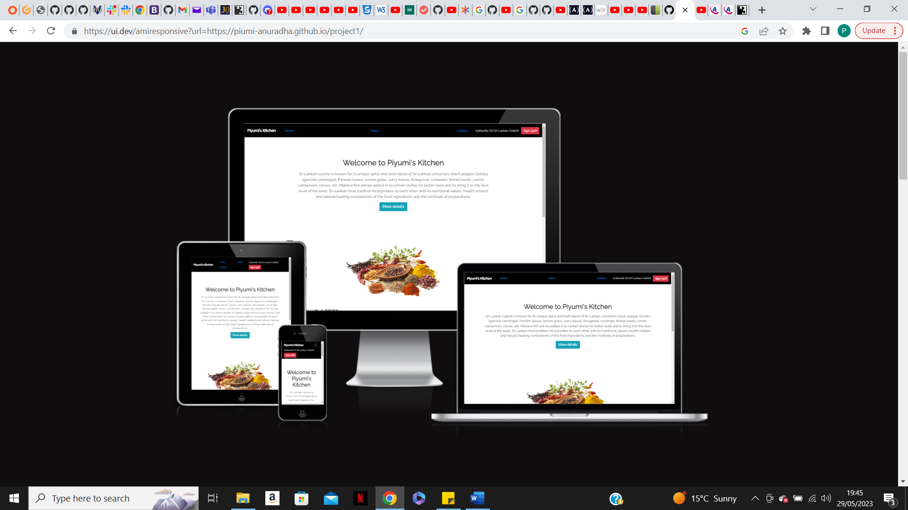
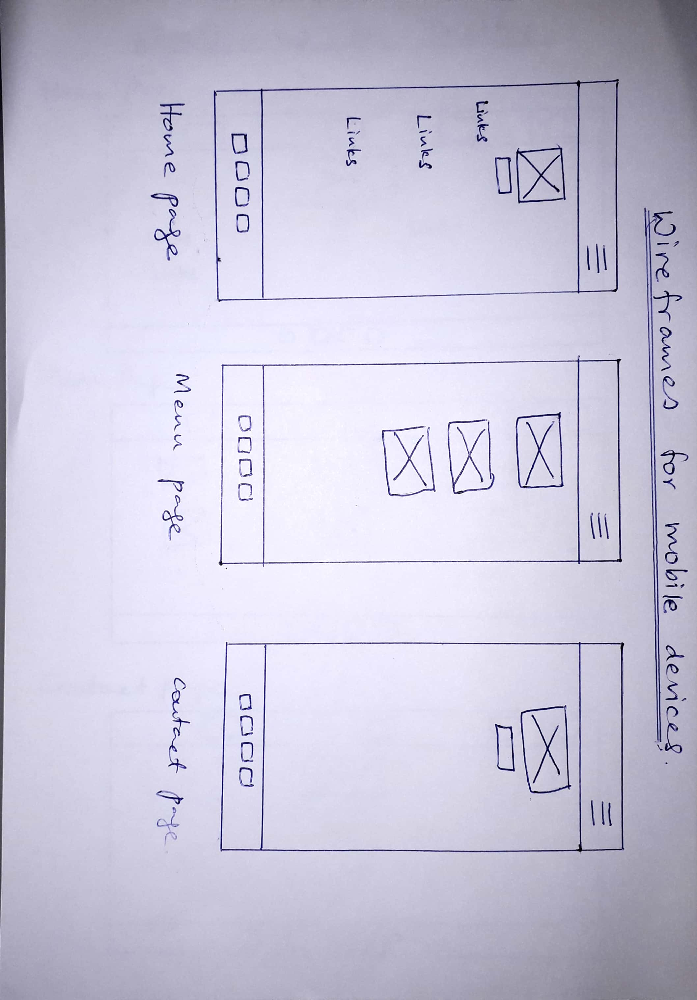
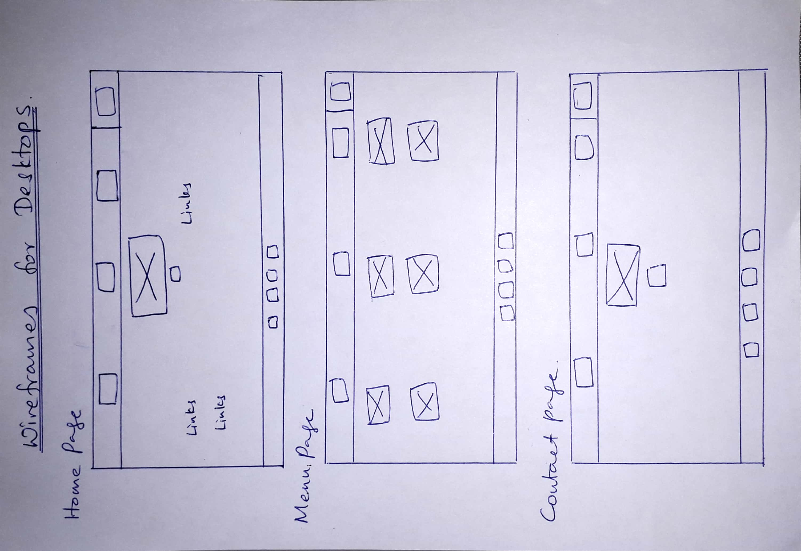
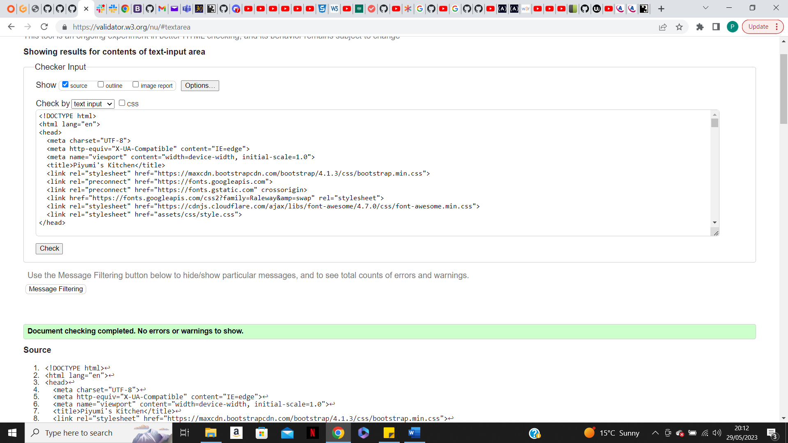
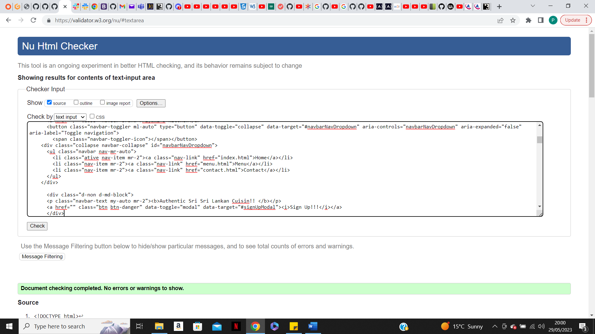
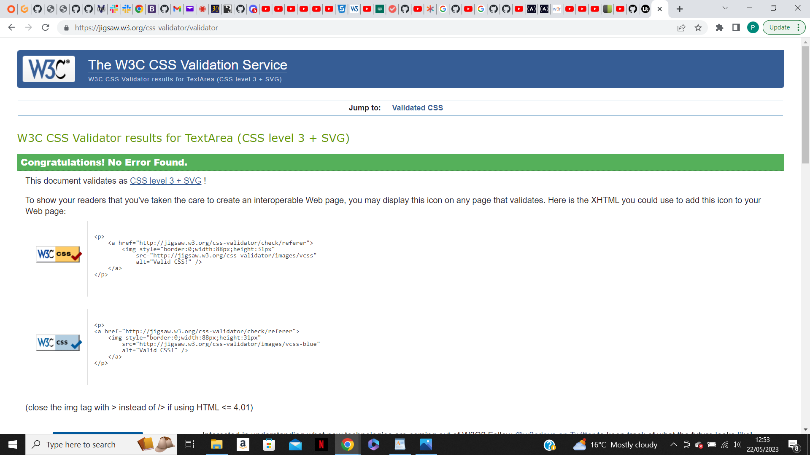
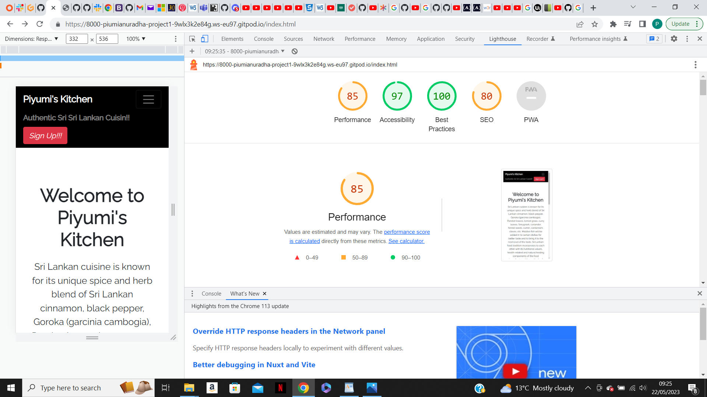
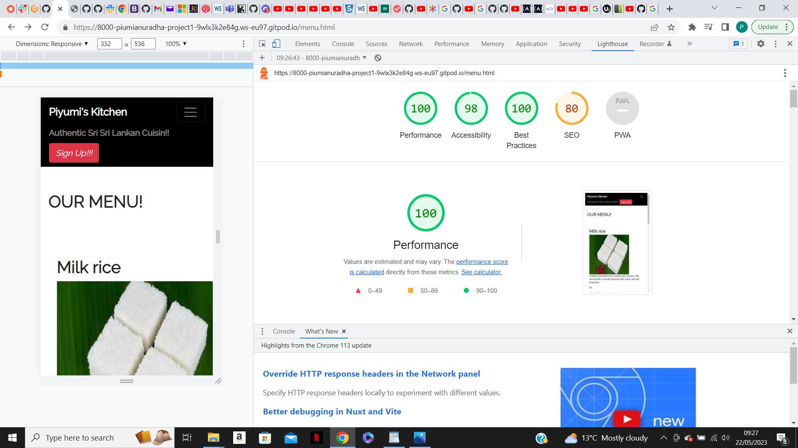
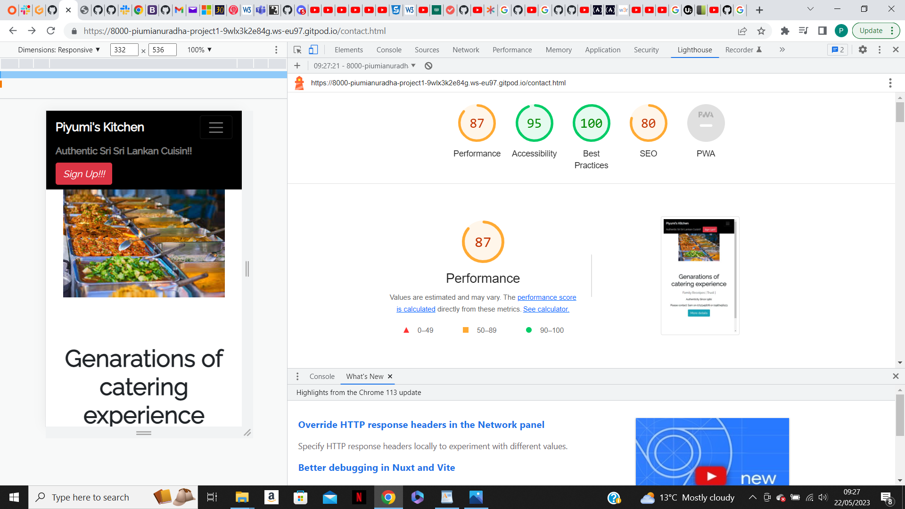

Piyumi's Kitchen website is designed to be responsive that allows visitors to view using a range of devices. This website allows the visitors to find out about authentic Sri Lankan food in a menue.

# Content
- ## User Experience (UX)
   - Initial Discussion
   - User Stories

- ## Design
   - Color scheme
   - Typography
   - Imagery
   - Wireframes
   - Features
   - Accessibility

- ## Technologies Used
   - Languages used
   - Frameworks, Libraries and programmes used

- ## Deployement

- ## Testing
   - W3C Validator
   - Solved Bugs
   - Lighthouse
         - Index page
         - Menu Page
         - Contact Page
   
- ## Credits
   - Code used
   - Content
   - Media
   - Acknoledgement

## Initial Discussion

Piyumi's Kitchen is a family run, small scale business situated in Hertfirdshire. the target audience of the Piyumi's Kitchen is takeaway customers, customers who are being delivered to their door steps and the customers who expect our service for outdoor catering. Therefore this web site provides the information about all the food items in the menues and replies all the information asked by the customers who the sign in to our website.

## User Stories

### Customer Goals
The potential customers of Piyumi's Kitchen, specially the customers who make takeaway orders and deliveries  expect a quick ordering process and a userfriendly navigation on the website.

### Developer and business goals
From the developer's point of view, very streightfoward and less complicated web development wil be aimed. At the same time the business aims to provide a userfriendly and a quick service to the target audience in order to gain profits.

## Design

### Colours
- Black color was used for the background of header and the footer for the clear visibility of the fonts.
- White color was chosen as the background color for the whole website for clear visibility of the content. 

### Fonts
- The primary font Raleway was chosen because it makes the audience easier to view. 
- The secondary font San-sarif was chosen.

### Wire frames
- All the wireframes were hand drawn as drawing on a paper was found easier and quicker for the developer. 
- Three of each wire frames were desingned for smaller devices and desktop version. 

## Features

This website is comprise of three pages. They are Home page, Menu page and Contact page.
- All pages on the website have,
      - A responsive navigation bar at the top which allow the users to navigate through the site.   
        To the left of the navigation bar has the " Piyumi's Kitchen" fonts. To the middle of the navigation bar are the links to the page of the website (Home, Menu, Contact) and to the right to the navigation bar is the sign up page.

      - The footer contains social media links to facebook, twitter, linkedIn, Pinterest, Instagram 
        and YouTube.

- Home Page
      - JumboTrone has been used for "Welcome to Piyumi's Kitchen" section.
      - The button for "More details" and the button for "Sign Up" at the right corner of the   
        navigation bar have used the same code which opens to the same inquiry box.
      - There are three links in the body of the page that navigate the Home page, Menu page and 
        Contact page.

- Menu Page
      - JomboTrone has been used for the menu page.

- Contact Page
      - Provides the means of contacting the seller.
      - "More details" button has used the same code as the "More details" button in the Menu page 
        and the navigation bar.

## Accessibility

It has been ensured that the website is as accessible friendly as possible. I was able to achieve this accessibility by;
         - Using semantic HTML
         - Using descriptive alt atributes on images on the website
         - Ensuring that there is a sufficient color contrast through out the website.

## Technologies Used
   - Languages used
      - HTML and CSS was used to create the website. 
   - Frameworks, Libraries and Programmes used
      - Git - version control
      - GitHub - For version control
      - BootStrap version 4.2- The framework for the website. Code for the navigation bar, cards, 
        Jumbotrone and forms were used and modified. 
      - CSS styling was also used in style.css additionally. 
   - Font Awsome- To import the fonts that used on the website.
   - Google Dev Tools- To troubleshoot and test features, solve issues with responsiveness and 
     styling. 
   - [Tiny PNG](https://tinypng.com/) - To compress the images.
   - [Am I Responsive?](https://ui.dev/amiresponsive)- This wbsite is used to show the website  
     images of the range of devices.

## Deployment

GitHub pages were used to deploy the live website. The instructions are given below.
1. log in (or sign up) to GitHub
2. Find the reporsitory for this project. My project is "Piumi-Anuradha/project1"
3. Click on the settings link.
4. Click on the "Pages" link in the left and side navigator bar.
5. In the source section, choose main from the drop down, select brance menu. Select Root from the 
   drop down select folder menu. 
6. Click Save. Your live GitHub pages site is now deployed at the URL shown. 

## Testing

Crome developer tools has have been used while building to pinpoint and troubleshoot any issue.

The following issues were raised during the meeting with the mentor.
   - The navbar for the smaller devices was not alighning properly. This issue was documented in the 
     solved bugs section. 
   - The image on the home page was not alligned to the middle. This issue has been documented under 
     the solved bugs section. 
   - Social links on the footer were not opening. Bug was solved and documented under the solved 
     bugs.
   

### W3C Validator

The W3C validator was used to validate the HTML on all pages of the website. And also this validator has been used to validate the CSS in the style.css file.

- Some errors were found in index, menu and contact.html pages when validating. 
  The issues were documented under solved bugs.
   - Index Page in HTML
   
   - Menu Page in HTML 
   

   - Contact Page in HTML
   
   - style.css in CSS
   

### Solved bugs
 1. Made adjustments to the Jumbotrone code to allign the navbar properties. 
 2. Made adjustments to the Jumbotrone code to allign the image.
 3. Fixed the issues according to the W3C validator.

### Lighthouse
Lighthouse has been used within the Crome Developer tools to allow me to test the performance, accessibility, best practices and SEO of the website.

Index Page

Menu Page

Contact Page

## Acknowledgement

I would like to take this as an opportunity to acknownledge the following people who helped me along the way in completing my first milestone project:

1. Ms Rachel Furlong - the tutor,for her help in completing my project.
2. Mr Ben Kavanagh - the mentor, for his help in the milestone project

